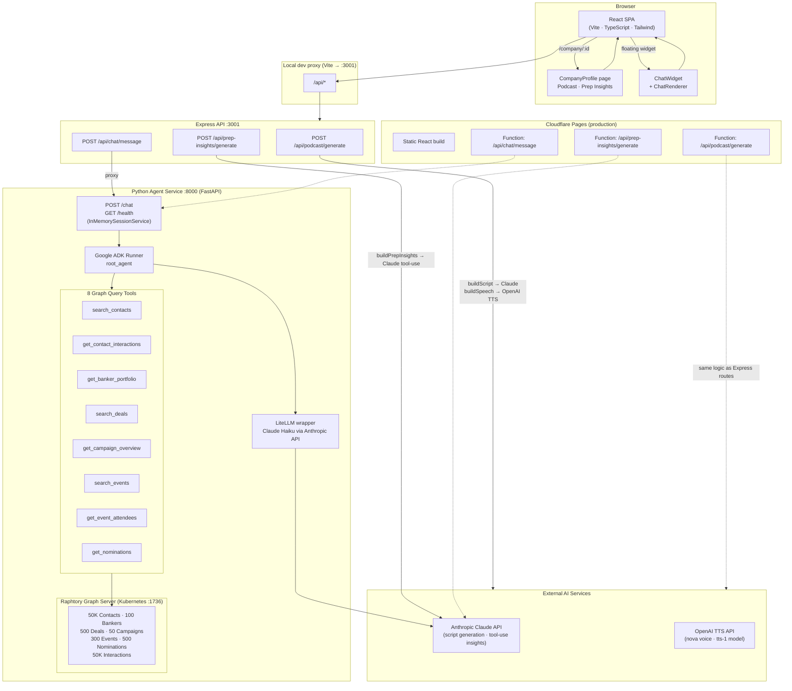

# Pandora

AI-powered investment banking CRM. A mobile-first React SPA that helps commercial bankers prepare for client meetings through three AI-driven features: podcast briefings, structured meeting prep insights, and a conversational CRM chatbot backed by a graph database.

## Features

- **Podcast briefings** — generates a spoken audio briefing for any client meeting using Claude (script) + OpenAI TTS (audio)
- **Meeting prep insights** — produces structured JSON analysis of a client relationship using Claude tool-use: key themes, talking points, risks, and recommended actions
- **CRM chatbot** — floating chat widget powered by a Google ADK agent that queries a Raphtory graph of 50K+ contacts, interactions, deals, campaigns, events, and nominations; responses render as rich UI components (tables, cards, metrics, badges)

## Architecture



## Tech Stack

| Layer | Technology |
|---|---|
| Frontend | React 18, TypeScript, Vite, Tailwind CSS, React Router v6 |
| Express API | Node.js, Express 5, TypeScript |
| AI (podcast + insights) | Anthropic Claude API, OpenAI TTS |
| AI (chatbot) | Google ADK, LiteLLM, Claude Haiku via Anthropic API |
| Graph database | Raphtory (Rust-backed temporal property graph, served via Kubernetes) |
| Python service | FastAPI, Uvicorn |
| Graph hosting | Kubernetes (Docker Desktop or any cluster) |
| Production hosting | Cloudflare Pages (frontend) + Cloudflare Pages Functions (API) |

## Prerequisites

- Node.js 18+
- Python 3.11+
- An Anthropic API key
- An OpenAI API key (for TTS audio)
- Docker Desktop with Kubernetes enabled (for the Raphtory graph server)

## Setup

### 1. Clone and install Node dependencies

```bash
git clone https://github.com/vsshan/pandora.git
cd pandora
npm install
```

### 2. Configure root environment variables

```bash
cp .env.example .env
```

Edit `.env`:

```
ANTHROPIC_API_KEY=sk-ant-...
OPENAI_API_KEY=sk-...
PORT=3001
AGENT_SERVICE_URL=http://localhost:8000
```

### 3. Install Python dependencies

```bash
cd agent
pip install -r requirements.txt
```

### 4. Configure agent environment variables

```bash
# from the agent/ directory
cp .env.example .env
```

Edit `agent/.env`:

```
ANTHROPIC_API_KEY=sk-ant-...   # same key as root .env
RAPHTORY_URL=http://localhost:1736   # port-forwarded Raphtory server (local dev)
```

### 5. Build the Raphtory CRM graph (one-time)

```bash
# from the project root
python -m agent.graph.ingest
```

This generates mock data (50K contacts, 50K interactions, 100 bankers, 500 deals, 300 events, 50 campaigns, 500 nominations) and saves the graph to `agent/graph/pandora_graph.bin`. Takes ~30 seconds.

### 6. Deploy the Raphtory graph server to Kubernetes (one-time)

The graph is served via a Raphtory GraphQL server running in Kubernetes. Build and push the Docker image, then deploy it:

```bash
cd agent/graph

# Build the image (bundles pandora_graph.bin into the container)
docker build -t localhost:5000/raphtory-crm-graph:v1 -f dockerfile .
docker push localhost:5000/raphtory-crm-graph:v1

# Create the namespace and deploy
kubectl create namespace ai-agents
kubectl apply -f raphtory-deployment.yaml
```

Verify the pod is running:

```bash
kubectl get pods -n ai-agents
# NAME                               READY   STATUS    RESTARTS   AGE
# raphtory-server-xxx-xxx            1/1     Running   0          30s
```

> **Note:** The image requires a local Docker registry at `localhost:5000`. If you don't have one running, start it with: `docker run -d -p 5000:5000 --name registry registry:2`

## Starting the Services

Pandora requires **four processes** running simultaneously in local development.

### Terminal 1 — Raphtory graph server port-forward

The Raphtory server runs in Kubernetes and must be forwarded to `localhost:1736` so the Python agent can reach it:

```bash
kubectl port-forward -n ai-agents svc/raphtory-service 1736:1736
```

Keep this terminal open. The Raphtory GraphQL UI is then accessible at [http://localhost:1736](http://localhost:1736).

### Terminal 2 — Python ADK agent service (port 8000)

```bash
python -m uvicorn agent.main:app --port 8000 --reload
```

### Terminal 3 — Express API server (port 3001)

```bash
npm run dev:server
```

### Terminal 4 — React dev server (port 5173)

```bash
npm run dev
```

Or start the Express server and React dev server together:

```bash
npm run dev:all
```

Then open [http://localhost:5173](http://localhost:5173).

> The React dev server proxies all `/api/*` requests to the Express server on port 3001, which in turn proxies `/api/chat/*` to the Python agent on port 8000.

## Project Structure

```
pandora/
├── src/                        # React frontend
│   ├── components/
│   │   ├── ChatWidget.tsx      # Floating chat UI (resizable)
│   │   ├── ChatRenderer.tsx    # json-render spec renderer
│   │   ├── PodcastPlayer.tsx   # Audio briefing player
│   │   └── MeetingPrepInsights.tsx
│   ├── hooks/
│   │   ├── useChat.ts          # Chat session state
│   │   ├── usePodcast.ts       # Podcast generation + playback
│   │   └── usePrepInsights.ts  # Insights generation + caching
│   ├── pages/
│   │   ├── Home.tsx            # Company list / feed
│   │   └── CompanyProfile.tsx  # Per-company meeting prep view
│   └── types/
│       ├── chat.ts
│       ├── podcast.ts
│       └── prepInsights.ts
├── server/                     # Express API (local dev)
│   ├── index.ts
│   ├── routes/
│   │   ├── podcast.ts          # POST /api/podcast/generate
│   │   ├── prepInsights.ts     # POST /api/prep-insights/generate
│   │   └── chat.ts             # POST /api/chat/message → proxies to :8000
│   └── lib/
│       ├── buildScript.ts      # Claude prompt → podcast script
│       ├── synthesizeSpeech.ts # OpenAI TTS → MP3 stream
│       └── buildPrepInsights.ts# Claude tool-use → insights JSON
├── functions/                  # Cloudflare Pages Functions (production)
│   └── api/
│       ├── podcast/generate.ts
│       ├── prep-insights/generate.ts
│       └── chat/message.ts
├── agent/                      # Python chatbot service
│   ├── agent.py                # ADK root_agent + 8 graph query tools
│   ├── main.py                 # FastAPI app (POST /chat, GET /health)
│   ├── requirements.txt
│   └── graph/
│       ├── schema.py               # Vertex / edge / property name constants
│       ├── mock_data.py            # Faker-based CRM data generators
│       ├── ingest.py               # Builds and saves pandora_graph.bin
│       ├── dockerfile              # Bundles graph into Raphtory server image
│       └── raphtory-deployment.yaml# Kubernetes Deployment + Service (ai-agents namespace)
└── .env.example
```

## AI Pipelines

### Podcast

`POST /api/podcast/generate` → `buildScript.ts` (Claude generates a briefing script) → `synthesizeSpeech.ts` (OpenAI TTS, voice: nova, model: tts-1) → MP3 audio stream

### Meeting Prep Insights

`POST /api/prep-insights/generate` → `buildPrepInsights.ts` (Claude with tool-use for structured JSON output) → insights JSON

### CRM Chatbot

```
ChatWidget → POST /api/chat/message (Express)
                  └── POST /chat (FastAPI :8000)
                           └── Google ADK Agent (Claude Haiku via LiteLLM)
                                    └── 8 tools → RaphtoryClient.receive_graph()
                                                        └── Raphtory server (Kubernetes :1736)
                                                             └── pandora_graph.bin (baked into image)
```

The Python agent connects to the Raphtory server via `RaphtoryClient` from `raphtory.graphql`. In local dev the server is exposed at `localhost:1736` via `kubectl port-forward`; in-cluster it is reachable at `raphtory-service.ai-agents.svc.cluster.local:1736`. The URL is configured via the `RAPHTORY_URL` environment variable.

**Agent tools:**

| Tool | Description |
|---|---|
| `search_contacts` | Search by name/company, filter by tier or sector |
| `get_contact_interactions` | Interaction history for a contact |
| `get_banker_portfolio` | A banker's contacts, deals, and hosted events |
| `search_deals` | Pipeline search by stage, sector, or deal type |
| `get_campaign_overview` | Campaign list with enrolment counts |
| `search_events` | Event search by type or location |
| `get_event_attendees` | Contacts attending a specific event |
| `get_nominations` | Client award nominations by status or category |

Agent responses are json-render UI specs rendered by `ChatRenderer.tsx` into tables, cards, metrics, and badges.

## Build & Deploy

```bash
# Type-check + production build
npm run build

# Deploy to Cloudflare Pages
npm run deploy
```

Set `ANTHROPIC_API_KEY`, `OPENAI_API_KEY`, and `AGENT_SERVICE_URL` in the Cloudflare Pages dashboard. The Python agent service must be deployed separately and reachable at `AGENT_SERVICE_URL`.
